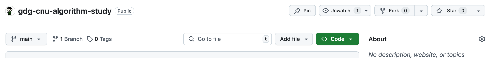
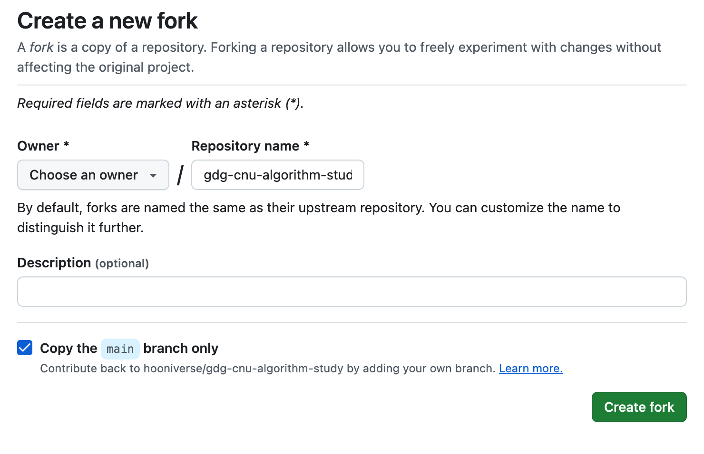

# gdg-cnu-algorithm-study

GDG-CNU 알고리즘 스터디입니다.

 

 

## 알고리즘 스터디 진행 가이드 

 

### 1. 알고리즘 스터디 저장소를 본인의 계정으로 fork 합니다.

[알고리즘 스터디 저장소](https://github.com/hooniverse/gdg-cnu-algorithm-study) 우측 상단의 fork 버튼을 클릭하여 본인의 계정으로 복사합니다.

 
 

### 2. fork한 저장소를 자신의 컴퓨터로 clone 합니다.

fork한 저장소를 자신의 컴퓨터로 복사하여 작업합니다.

- 터미널에서 다음 명령어를 입력합니다.

~~~
git clone https://github.com/{본인아이디}/{저장소 이름}.git
ex) https://github.com/hooniverse/gdg-cnu-algorithm-study
~~~
- 본인 아이디는 본인인 Github 아이디 /저장소 아이디는 fork할 때 지정한 이름입니다.

 
 

### 3. 매주 알고리즘 제출을 위해 브랜치 생성합니다.

 

git은 서로 다른 작업을 하기 위한 별도의 공간을 만들기 위해 브랜치를 생성할 수 있습니다.

- 터미널에서 다음 명령어를 입력합니다.

    - 저장소 안에서 명령어를 실행해야 합니다.

~~~
git checkout -b {해당주차_본인이름}
ex_ git checkout -b week0_sunghoon
~~~

 
 

### 4. 해당 주차 폴더에서 과제 수행합니다.

 

해당 주차 폴더에서 본인의 이름으로 된 폴더를 생성 후, 그 폴더 안에서 과제를 수행하면 됩니다.

주차 별 과제 안내는 해당 주차 폴더 내에서 확인할 수 있습니다.

 
 

### 5. 과제 수행 후 add와 commit 합니다.

 

과제를 전부 완료하면 `add`와 `commit`을 통해 본인의 로컬 저장소에 반영해줍니다.

~~~

~~~

 
 

### 6. 본인의 원격 저장소에 보냅니다.

 

`commit`을 수행하면 로컬 저장소에만 반영되고 원격 저장소에는 반영되지 않습니다. `push`를 통해 github 원격 저장소에 보냅니다.

~~~
git push origin {해당주차 브랜치이름}
ex_ git push origin week1_sunghoon
~~~

 
 

### 7. Pull Request를 보냅니다.

 
₩
Pull Request를 통해 알고리즘 스터디에 과제를 제출합니다.

1. 브라우저에서 본인이 fork한 저장소에 접속
2. 브랜치를 해당 주차 브랜치로 변경
3. `Compare & pull request` 버튼 클릭

- Pull Request 제목은 `[$해당주차] $이름 알고리즘 제출합니다.` 으로 작성합니다. 

-  `Create pull request` 버튼을 클릭하여 제출합니다. 